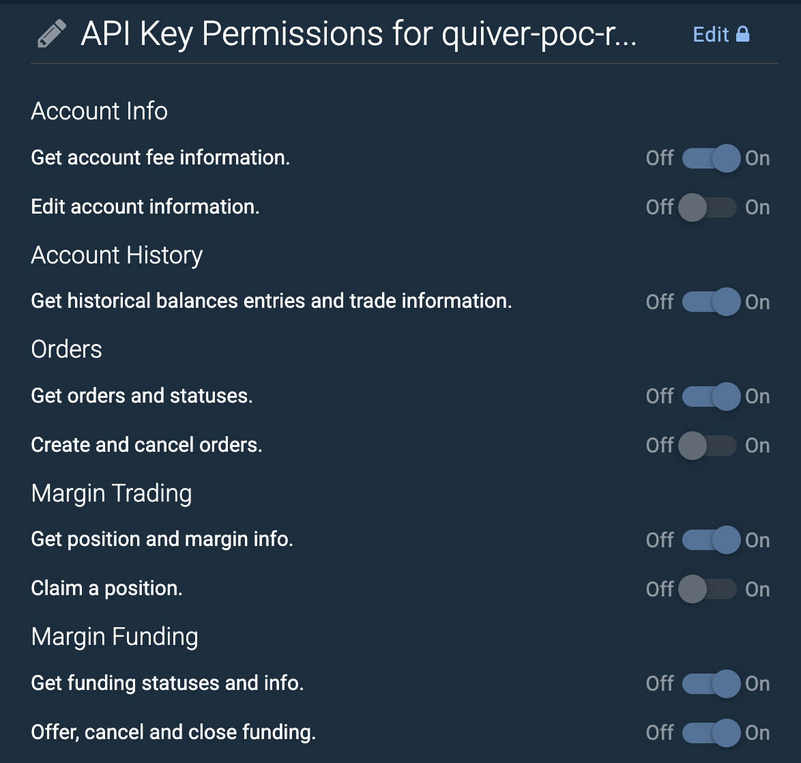
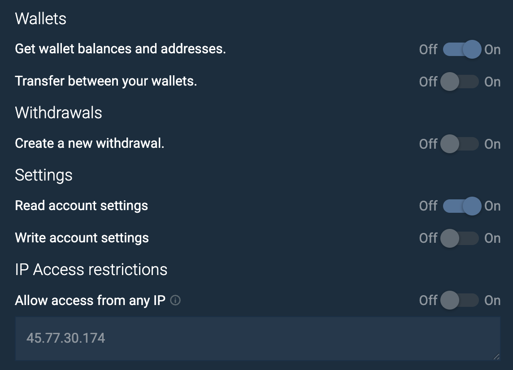

# Quiver Earn — Bitfinex API Key 設定教學

> 給準備加入 Quiver Earn 的用戶看 — 5 分鐘設好 API key,讓 Quiver 自動幫你在 Bitfinex 放貸賺利息。
>
> **核心原則**:你的錢始終在你**自己的** Bitfinex 帳號裡(自己 KYC 過),Quiver 只有「掛 funding offer」跟「取消 funding offer」的權限,**沒有提錢的權限**(永遠不開 Withdrawal)。

---

## 為什麼這樣設計

Quiver 用你給的 API key 幫你做這些事:
- 讀你 Bitfinex Funding wallet 的 USDT 餘額(顯示在 Quiver dashboard)
- 自動把你存進 Quiver 的 USDT 送到你 **Bitfinex Funding 入金地址**
- 自動以 FRR(浮動利率)掛 2 天期的 funding offer
- 到期後自動續

Quiver **不會**做的事:
- ❌ 從你 Bitfinex 提錢(我們連這個權限都不要,被偷也偷不走)
- ❌ 動你 Exchange / Margin wallet 的錢
- ❌ 幫你 trade / 開倉 / 平倉
- ❌ 改你帳號設定

---

## 步驟一:登入 Bitfinex,開新 API Key

1. 登入 https://bitfinex.com
2. 右上角頭像 → **API Keys**(或直接到 https://setting.bitfinex.com/api )
3. 點 **「Create New API Key」**

---

## 步驟二:設 Label

Label 建議用 **`quiver-earn`**(或 `quiver-pathA-rw` 之類能辨識的)。

未來如果你有多個工具要連 Bitfinex,看 label 一眼就知道哪個 key 是給誰的、權限怎麼設,也方便日後 rotate。

---

## 步驟三:勾選權限(超重要,看清楚)

### ✅ 要打開的(11 個)

| Section | Permission | 為什麼 |
|---|---|---|
| Account Info | Get account fee information | 算 fee 跟收益用 |
| Account History | Get historical balances entries and trade information | 算每日 interest accrual |
| Orders | Get orders and statuses | 一致性對帳 |
| Margin Trading | Get position and margin info | 一致性對帳 |
| **Margin Funding** | **Get funding statuses and info** ⭐ | 讀你目前 funding 部位 |
| **Margin Funding** | **Offer, cancel and close funding** ⭐ | **核心**:讓 Quiver 幫你掛 / 取消 funding offer |
| **Wallets** | **Get wallet balances and addresses** ⭐ | 讀餘額 + auto-fetch 你的 funding 入金地址 |
| Settings | Read account settings | 讀帳號狀態(KYC level / region 等) |

### ❌ 絕對不要打開(6 個)

| Section | Permission | 風險 |
|---|---|---|
| Account Info | Edit account information | 改你帳號資料 |
| Orders | Create and cancel orders | 拿來幫你下單交易 |
| Margin Trading | Claim a position | 接收別人轉過來的槓桿倉位,直接虧錢的入口 |
| Wallets | Transfer between your wallets | 在你 Exchange / Margin / Funding 之間搬錢 |
| **Withdrawals** | **Create a new withdrawal** ⭐ | **最大威脅**:把你的錢提到外面。永遠永遠不要開,即使有人說「方便我們幫你贖回」 |
| Settings | Write account settings | 改帳號設定 |

---

## 步驟四:設 IP Allowlist(必做)

Bitfinex 提供「只允許特定 IP 用這把 key」的保護,即使 key 外洩,從別的 IP 來也用不了。

1. 找到 **「IP Access restrictions」** 區塊
2. **「Allow access from any IP」維持 OFF**
3. 在下面框框裡填 Quiver 的 prod server IP:

```
45.77.30.174
```

> 如果你看到別的 IP / 多個 IP 是因為日後 Quiver 擴增 server,屆時 Tommy 會在公告說明。目前單一 IP 即可。

---

## 步驟五:2FA + Generate Key

1. 輸入你 Bitfinex 帳號的 2FA 驗證碼
2. 點 **Generate Key**(或 Save)
3. Bitfinex 會顯示 **API Key** + **API Secret**(secret 只顯示一次,看到立刻複製)

格式類似:
```
API Key:    t-xxxxxxxxxxxxxxxxxxxxxxxxxxxxxxxxxxxxxxxx
API Secret: yyyyyyyyyyyyyyyyyyyyyyyyyyyyyyyyyyyyyyyy
```

---

## 步驟六:複製你的 Funding wallet TRC20 入金地址

Quiver 需要知道把你的 USDT 送到哪裡。雖然你 key 給 Quiver 了,Bitfinex API 不允許安全地讀這個地址(技術細節:他們只在會給「提現權限」的 key 上開放,我們堅決不開那個權限)。所以這個地址要你**手動複製給 Quiver 一次**。

1. Bitfinex → **Wallets** → **Deposit**
2. 選 **Tether (USDt)**
3. 選 **Network: Tron (TRX)**
4. 你會看到三個地址(Exchange / Margin / Funding 各一個獨立永久地址)
5. **只複製 Funding wallet address**(不是 Exchange,不是 Margin)
6. 看起來像:`TGU1raNDB94...`(34 字元,T 開頭)

⚠️ **複製錯地址會讓錢卡在錯的 wallet** — Quiver 會送進你 Funding wallet,但如果你給的是 Exchange 地址,錢會卡在 Exchange 端(你需要在 Bitfinex 內部 Transfer Exchange→Funding 才能放貸)。一定要 Funding。

---

## 步驟七:把 key + 地址安全地給 Quiver

⚠️ **不要**用以下方式傳:
- ❌ Email(永久存在,難刪)
- ❌ 公開群組訊息
- ❌ 截圖貼到 Slack / Discord
- ❌ Google Docs(任何雲端文件)

✅ **推薦**:
- ✅ Signal(end-to-end encrypted,可設訊息自動 expire)
- ✅ Telegram secret chat(注意是 **secret chat**,不是普通對話)
- ✅ 1Password 加密 share link
- ✅ 當面口頭

格式給 Tommy:
```
Quiver Earn API key:
Key:                t-xxxxxxxxxxxxxxxxxxxxxxxxxxxxxxxxxxxxxxxx
Secret:             yyyyyyyyyyyyyyyyyyyyyyyyyyyyyyyyyyyyyyyy
Label:              quiver-earn
Funding deposit:    TGU1raNDB94xxxxxxxxxxxxxxxxxxxxxxxxxx   ← 步驟六複製的
```

Tommy 收到後會立刻在 Quiver 加密存(AES-GCM + KEK,跟錢包私鑰同等級保護),然後從 Signal 把訊息刪掉。

---

## 步驟八:測試 1 USDT 驗證(強烈建議)

第一次正式存大額之前,先存 **1 USDT** 測流程:

1. 從你別的錢包送 1 USDT-TRC20 到你的 Quiver 入金地址
2. 5-10 分鐘後檢查 Bitfinex Funding wallet,應該看到 **+1 USDT**(因為 < 150 不會掛 offer,只會搬到 Funding wallet 累積)
3. 確認後,你就能放心存大額,Quiver 會自動把累積到 ≥ 150 USDT 的部分掛 funding offer 開始賺利息

---

## ✅ 驗證:你設定好的 key 應該長這樣

### 上半段(權限)



### 下半段(權限 + IP allowlist)



對照上面截圖,逐欄確認:
- 該 ON 的全 ON ✅
- 該 OFF 的全 OFF ❌
- IP allowlist 框框裡是 `45.77.30.174`,且「Allow access from any IP」是 OFF

---

## FAQ

### Q1. 我可以隨時撤銷 Quiver 的權限嗎?
可以,**任何時候**到 https://setting.bitfinex.com/api 點 Revoke 那把 key,Quiver 立刻無法再操作你的 Bitfinex。你 Bitfinex 上的部位完全不受影響。

### Q2. 萬一 key 被偷會怎樣?
- 攻擊者**不能提走你的錢**(沒 Withdrawal 權限)
- 攻擊者**不能在 wallet 之間搬錢**(沒 Transfer 權限)
- 攻擊者最多能**幫你掛 / 取消 funding offer**,結果就是你少賺一點利息(壞 offer rate)。沒有真的損失本金的路徑
- 加上 IP allowlist 限制,攻擊者必須先攻陷 Quiver server 才能用這把 key
- 即使如此,看到異常立刻去 Bitfinex 把 key revoke 即可

### Q3. 我的 Bitfinex KYC 不夠 level 可以用嗎?
要看你想存多少。Bitfinex Funding 一般要 Intermediate KYC(等級 2)以上才能用。如果你還沒做,先在 Bitfinex 完成 KYC 再來。

### Q4. Bitfinex 出問題 / API 中斷怎辦?
- Bitfinex 偶爾 maintenance(每月幾次,各 1-2 hr),那段期間 Quiver sync 看不到你部位,顯示「sync failed」,但你錢都好好的在 Bitfinex
- 結束後自動恢復
- 如果是大事故(Bitfinex 倒、被駭),那是大盤面風險,Quiver 也救不了——這是 CeFi 放貸固有風險,評估能不能接受再決定要存多少

### Q5. 我可以隨時把錢從 Bitfinex 提走嗎?
可以,**100% 在你控制**:
1. 先到 Bitfinex 把 active funding offer 取消(或等到期)
2. 等 funds idle 進 Funding wallet
3. 在 Bitfinex 提到你任何錢包(因為提現權限始終在你手上,Quiver 沒有)

> 之所以提現權限不給 Quiver,就是要保證**你錢的最終控制權永遠是你自己**。Quiver 連幫你 / 想搬都搬不走。

### Q6. Quiver 可以幫我自動贖回到 Quiver 嗎?
**目前不行**(也是設計上的選擇)。要做需要 Withdrawal 權限,風險不對等。短期 (Path A MVP) 維持 user 自己提現。如果未來真的有需要,我們會用更安全的多簽 / per-tx 確認機制再開放。

---

## 改完之後

1. 把 API key + secret 用安全管道給 Tommy(見步驟六)
2. Tommy 會把 key 加進 Quiver(目前是 admin onboarding,future Path A user UI `/earn/connect` 會讓你自己貼)
3. 接著只要把 USDT-TRC20 存進你的 Quiver 入金地址,5-10 分鐘內 Quiver 會自動轉到你 Bitfinex Funding wallet 並掛 offer
4. 從 Quiver `/earn` 看部位、收益、APY

---

## Reference

- 完整 product plan: [`EARN-PATH-A-MVP-PLAN.md`](EARN-PATH-A-MVP-PLAN.md)
- Bitfinex Funding 風險分析: [`EARN-V05-BITFINEX-AAVE-PLAN.md`](EARN-V05-BITFINEX-AAVE-PLAN.md)
- Bitfinex 官方 API 文件: https://docs.bitfinex.com/docs/rest-auth
